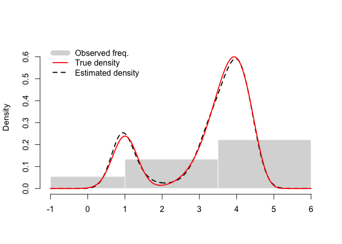

The *degross* R-package
================

The *degross* R-package enables to **estimate a density from** grouped
(tabulated) summary statistics evaluated in each of the big bins (or
classes) partitioning the support of the variable. These statistics
include **class frequencies and central moments of order one up to
four**.

The log-density is modelled using a linear combination of **P-splines**
(i.e. penalised B-splines). The multinomial log-likelihood involving the
frequencies adds up to a roughness penalty based on the differences in
the coefficients of neighbouring B-splines and the log of a root-n
approximation of the sampling density of the observed vector of central
moments in each class. The so-obtained penalized log-likelihood is
maximized using the EM algorithm to get an estimate of the spline
parameters and, consequently, of the variable density and related
quantities such as quantiles, see [Lambert
(2023)](http://doi.org/10.1016/j.insmatheco.2022.12.004) for details.

## The *degross* package in action

Let us first simulate data taking the form of a rough histogram
involving 3 big bins (or *classes*) with locally observed frequencies
and sample moments of orders 1 to 4:

``` r
## Package installation from R-CRAN
## install.packages("degross")
## Alternatively, installation from GitHub:
## install.packages("devtools")
## devtools::install_github("plambertULiege/degross")

## Package loading
library(degross)

## Simulate grouped data
sim = simDegrossData(n=3500, plotting=FALSE,choice=2,J=3)
```

The so-created object is a list containing

- the limits of the $J$ bigs bins partitioning the variable support ;
- the associated frequencies ;
- a $J\times 4$ matrix with the observed sample central moments :

``` r
sim[3:5]
```

    ## $Big.bins
    ## [1] -1.0  1.0  3.5  6.0
    ## 
    ## $freq.j
    ## [1]  385 1170 1945
    ## 
    ## $m.j
    ##             m1         m2           m3         m4
    ## Bin1 0.7477827 0.03454083 -0.005108447 0.00347503
    ## Bin2 2.5397375 0.78655451 -0.435406211 1.05553636
    ## Bin3 4.0497644 0.10804797  0.014748162 0.02961937

Let us create a *degrossData* object from these local summary
statistics:

``` r
## Create a degrossData object
obj.data = with(sim, degrossData(Big.bins=Big.bins, freq.j=freq.j, m.j=m.j))
print(obj.data)
```

    ## 
    ## Total sample size: 3500 
    ## 
    ## Observed class frequencies and central moments:
    ##      freq.j        m1         m2           m3         m4
    ## Bin1    385 0.7477827 0.03454083 -0.005108447 0.00347503
    ## Bin2   1170 2.5397375 0.78655451 -0.435406211 1.05553636
    ## Bin3   1945 4.0497644 0.10804797  0.014748162 0.02961937
    ## 
    ## Big bin limits: -1 1 3.5 6 
    ## No of big bins: 3  ; No of small bins: 300  ; No of B-splines: 25

Once the *degrossData* object has been created, the estimate of the
unknown underlying density can be obtained :

``` r
## Estimate the density underlying the grouped data
obj.fit = degross(obj.data)
print(obj.fit)
```

    ## 
    ## Total sample size: 3500 
    ## 
    ## Observed class frequencies and central moments:
    ##      freq.j        m1         m2           m3         m4
    ## Bin1    385 0.7477827 0.03454083 -0.005108447 0.00347503
    ## Bin2   1170 2.5397375 0.78655451 -0.435406211 1.05553636
    ## Bin3   1945 4.0497644 0.10804797  0.014748162 0.02961937
    ## 
    ## Big bin limits: -1 1 3.5 6 
    ## No of big bins: 3  ; No of small bins: 300  ; No of B-splines: 25 
    ## 
    ## Fitted moments of order 1 to 4:
    ##            mu1        mu2          mu3         mu4
    ## Bin1 0.7460004 0.03552231 -0.005863966 0.004422452
    ## Bin2 2.5433896 0.78118222 -0.430031469 1.045738457
    ## Bin3 4.0499949 0.10969853  0.015606548 0.031326807
    ## 
    ## Global fit statistics:
    ##          edf          aic          bic log.evidence 
    ##         10.3       6436.1       6499.7      -3240.4

It can also be plotted and compared to the true density (used to
generate the data) :

``` r
## Plot the estimated density...
plot(obj.fit)
## ... and compare it with the ('target') density used to simulate the data
curve(sim$true.density(x),add=TRUE,col="red",lwd=2)
legend("topleft",
       legend=c("Observed freq.","True density","Estimated density"),
       col=c("grey85","red","black"), lwd=c(10,2,2),
       lty=c("solid","solid","dashed"), box.lty=0, inset=.02)
```

<!-- -->

## License

**degross**: Density Estimation from GROuped Summary Statistics.
Copyright (C) 2021-2023 Philippe Lambert

This program is free software: you can redistribute it and/or modify it
under the terms of the GNU General Public License as published by the
Free Software Foundation, either version 3 of the License, or (at your
option) any later version.

This program is distributed in the hope that it will be useful, but
WITHOUT ANY WARRANTY; without even the implied warranty of
MERCHANTABILITY or FITNESS FOR A PARTICULAR PURPOSE. See the GNU General
Public License for more details.

You should have received a copy of the GNU General Public License along
with this program. If not, see <https://www.gnu.org/licenses/>.

## References

\[1\] Lambert, P. (2023) Nonparametric density estimation and risk
quantification from tabulated sample moments. Insurance: Mathematics and
Economics, 108: 177-189.
[doi:10.1016/j.insmatheco.2022.12.004](http://doi.org/10.1016/j.insmatheco.2022.12.004)

\[2\] Lambert, P. (2021). Moment-based density and risk estimation from
grouped summary statistics.
[*arXiv:2107.03883*](https://arxiv.org/abs/2107.03883)

\[3\] Lambert, P. (2021) R-package *ordgam* -
[R-cran](https://CRAN.R-project.org/package=degross) ; GitHub:
[plambertULiege/degross](https://github.com/plambertULiege/degross)
